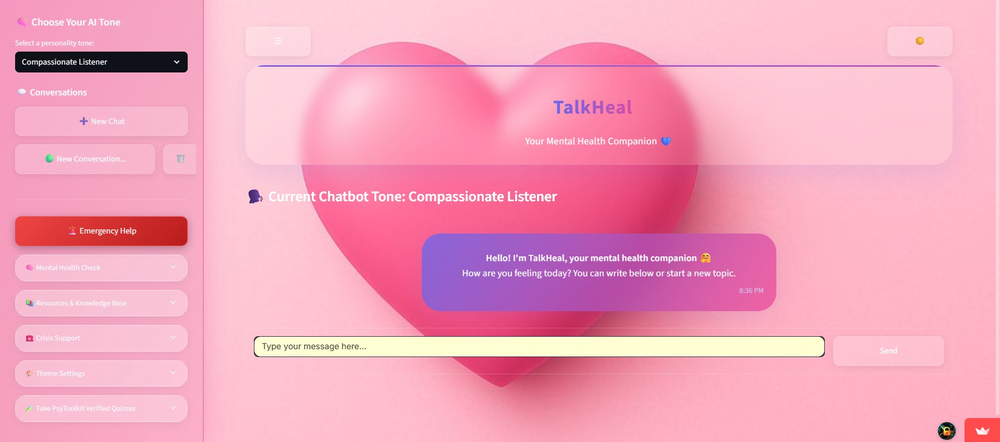
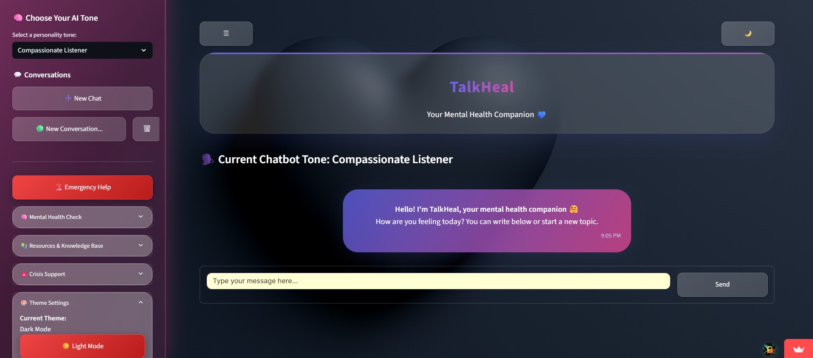
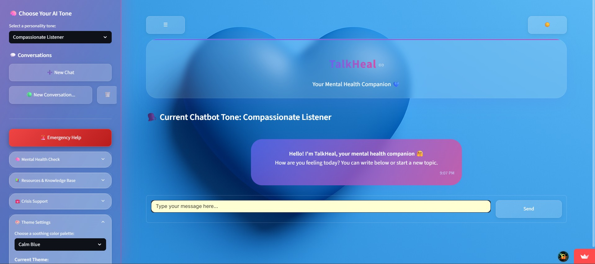
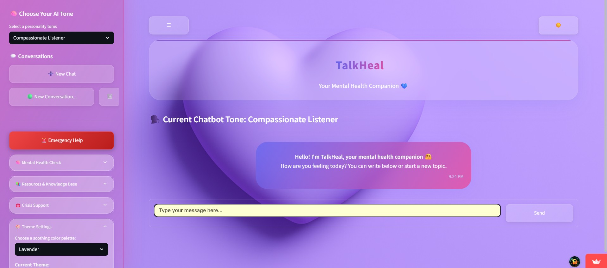

<div align="center"></div>

# <div align="center">TALKHEAL</div>

## 🧠 Your AI-Powered Mental Health Companion

**TalkHeal** is an empathetic, intelligent, and interactive mental health support assistant built using **Python** and **Streamlit**. Designed with compassion and care at its core, it offers 24/7 support, emotional journaling, resource guidance, and AI-powered conversations powered by Google’s Gemini Pro.

---

## ✨ Features

### 🗣️ Conversational AI Support

* Gemini-powered chatbot for mental health companionship
* Empathetic and encouraging tone—never clinical or diagnostic
* Smart conversation history with multi-threaded support
* **Chatbot personality tone selector**:  
  *Compassionate Listener*, *Motivating Coach*, *Wise Friend*, *Neutral Therapist*, *Mindfulness Guide*

### 📘 Resource & Crisis Help

* Emergency Help Button — instantly access local support via Google Maps
* International helpline directory and global mental health resources
* Mental health resource library with live search

### 🧪 Science-Backed Assessments

* Integrated **PsyToolkit**-verified mental health quizzes for self-evaluation

### 💖 Mood Tracking & Journaling

* Mood slider with five emotional states
* AI-assisted coping tips based on mood
* Micro-journaling support with reflection prompts

### 📌 Smart Prompts

* Instant-start suggestions like “Feeling overwhelmed” or “How to manage stress?”
* Direct conversion of journal thoughts into chatbot prompts

### 🎨 Themes & UI

* Multiple soothing themes: **Light**, **Calm Blue**, **Mint**, **Lavender**, **Pink**, and **Dark**
* 3D-inspired soft pink and magenta UI for a mentally soothing experience
* Smooth transitions and responsive design for mobile and desktop

---

## 🚀 Live Demo

### 🎯 **Experience TalkHeal live now!**  
🔗 [https://TalkHeal.streamlit.app](https://TalkHeal.streamlit.app)

---

## 📊 Project Stats

<p align="center">
  <a href="https://github.com/eccentriccoder01/TalkHeal">
    
  </a>
  <a href="https://github.com/eccentriccoder01/TalkHeal/fork">
    
  </a>
  <a href="https://github.com/eccentriccoder01/TalkHeal/graphs/contributors">
    
  </a>
  <a href="https://github.com/eccentriccoder01/TalkHeal/issues">
    
  </a>
  <a href="https://github.com/eccentriccoder01/TalkHeal/pulls">
    
  </a>
  <a href="https://github.com/eccentriccoder01/TalkHeal/commits/main">
    
  </a>
  <a href="https://github.com/eccentriccoder01/TalkHeal/blob/main/LICENSE">
    
  </a>
</p>

---

> 💡 **PRs Welcome!** We love contributions. Check out the [Contribution Guidelines](CONTRIBUTING.md) to get started.

## 📸 Screenshots

<div align="center">
  
  <br>
  </a>
  </a>
  </a>
</div>

## 📺 Video Explanation

For a detailed walkthrough of TalkHeal's features and how to use them, check out this video:

**[Insert YouTube Video Link Here]**

---

## 🛠️ Technologies Used

| Tech                  | Purpose                           |
| --------------------- | --------------------------------- |
| **Python**            | Core backend and AI logic         |
| **Streamlit**         | UI and frontend integration       |
| **Google Gemini API** | Generative AI Conversations       |
| **Session State**     | Manage multi-threaded chat memory |
| **CSS Variables**     | Theming and modern styling        |
| **Streamlit Secrets** | Secure API key management         |

---

## ⚙️ Installation and Setup

> Clone and run locally using Python and Streamlit.

1. **Clone the repository:**

   ```bash
   git clone https://github.com/eccentriccoder01/TalkHeal.git
   cd TalkHeal
   ```

2. **Install dependencies:**

   ```bash
   pip install -r requirements.txt
   ```

3. **Set up API key:**
   Go to your Streamlit [Secrets Settings](https://streamlit.io/cloud) and add:

   ```toml
   [gemini]
   api_key = "YOUR_GOOGLE_GEMINI_API_KEY"
   ```

4. **Run the app:**

   ```bash
   streamlit run TalkHeal.py
   ```

---

## Issue Creation ✴
Report bugs and  issues or propose improvements through our GitHub repository.

## Contribution Guidelines 📑

- Firstly Star(⭐) the Repository
- Fork the Repository and create a new branch for any updates/changes/issue you are working on.
- Start Coding and do changes.
- Commit your changes
- Create a Pull Request which will be reviewed and suggestions would be added to improve it.
- Add Screenshots and updated website links to help us understand what changes is all about.

- Check the [CONTRIBUTING.md](CONTRIBUTING.md) for detailed steps...
    
## Contributing is fun🧡

We welcome all contributions and suggestions!
Whether it's a new feature, design improvement, or a bug fix — your voice matters 💜

Your insights are invaluable to us. Reach out to us team for any inquiries, feedback, or concerns.

## 👥 Contributors

Thanks to these wonderful people for contributing 💖

[](https://github.com/eccentriccoder01/TalkHeal/graphs/contributors)

## 📄 License

This project is open-source and available under the [MIT License](LICENSE).

## 📞 Contact

Developed by [Eccentric Explorer](https://eccentriccoder01.github.io/Me)

Feel free to reach out with any questions or feedback\!
